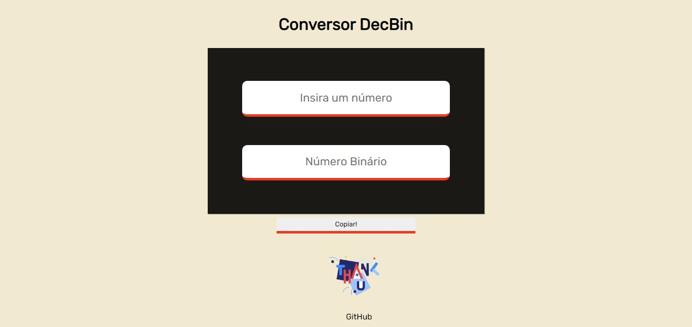
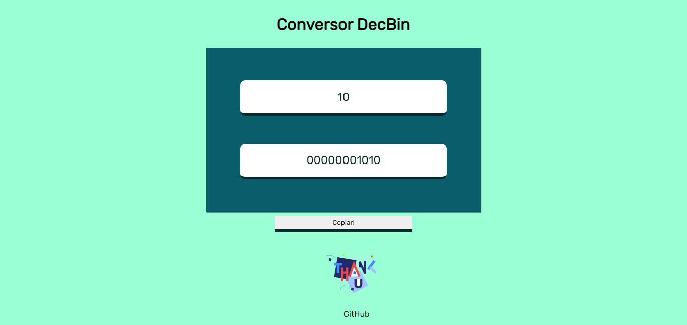
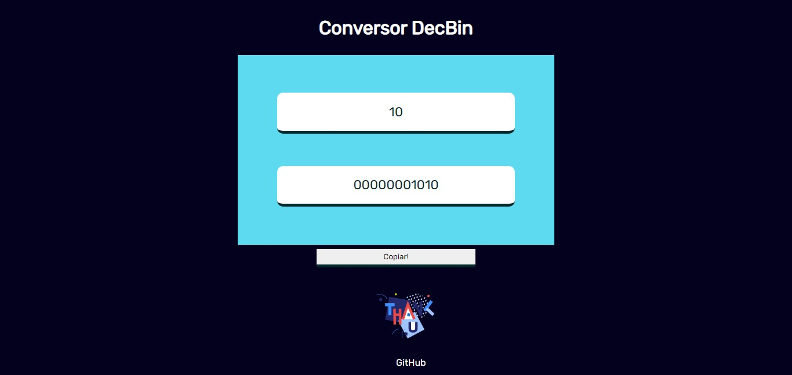
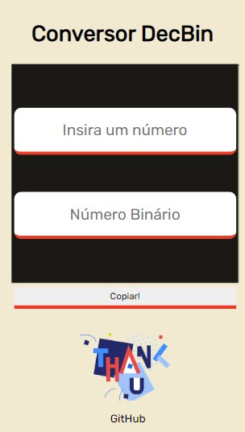
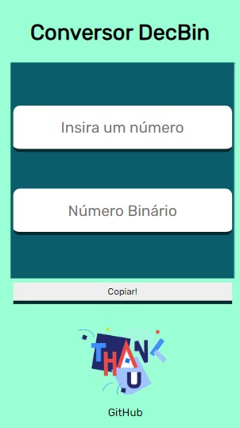
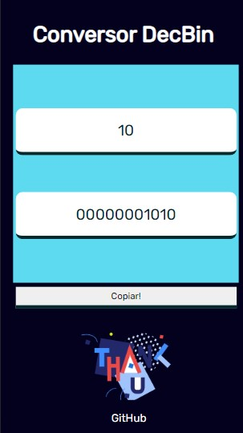

# DecBin 👨‍💻
<a href="https://shymarrai.github.io/decbin/">DecBin<a/>

DecBin - Conversor de Decimal para Binário #7DaysProjects

## Desafio para projetos que todo desenvolvedor deve fazer, em que eu me desafio a entregar um por dia.

## Skills

&nbsp;
&nbsp;
&nbsp;
&nbsp;
&nbsp;

# Exemplos

Desktop🖥💻

Mobile📱

